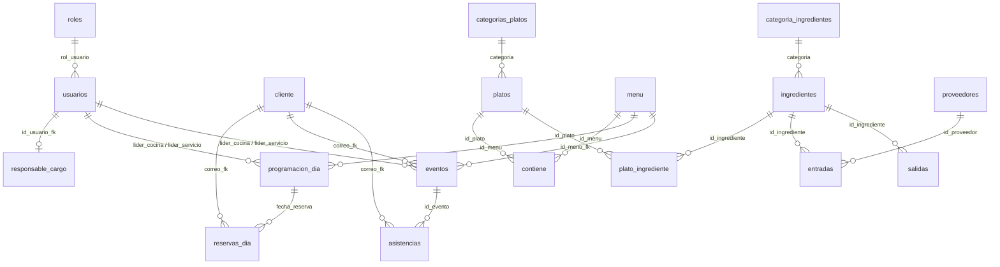

# REMY · Base de datos

Todo lo de la base `remy` vive en esta carpeta. Los volcados anteriores
(`remy.sql`, `remy_final.sql`, `remy _ultimav_version.sql`,
`remy_final_web.sql` y los dos parches) quedaron archivados en
[`../legacy/`](../legacy/) y ya no hay que usarlos.

| Archivo | Para qué |
|---|---|
| [`remy.sql`](remy.sql) | Crea la base desde cero: estructura + catálogos + datos de prueba. |
| [`migracion_integracion.sql`](migracion_integracion.sql) | Lleva una base `remy` que ya existe a la estructura de `remy.sql`, sin borrar nada. |

Los dos scripts **no tienen `DROP DATABASE` ni `DROP TABLE`** y se pueden
ejecutar varias veces: no duplican filas ni pisan las tablas de otros
módulos que ya estén en la base.

## Instalar

**Equipo nuevo** (no existe la base `remy`):

```bash
# Windows
"C:/xampp/mysql/bin/mysql.exe" -u root < remy.sql
# macOS
/Applications/XAMPP/xamppfiles/bin/mysql -u root < remy.sql
```

**Equipo que ya tiene la base** (cargada con cualquiera de los volcados viejos):

```bash
"C:/xampp/mysql/bin/mysql.exe" -u root < migracion_integracion.sql
```

Se probó la migración desde `remy_final_web.sql` y desde el `remy.sql`
original: en los dos casos la estructura queda idéntica a la de una
instalación limpia.

Usuarios de prueba para el panel (la contraseña son los 10 dígitos del teléfono):

| Rol | Correo | Contraseña |
|---|---|---|
| Instructor (1) | `instructor@sena.edu.co` | `3001234567` |
| Aprendiz (2) | `aprendiz@soy.sena.edu.co` | `3007654321` |

## Mapa de la base

19 tablas y 22 llaves foráneas, en seis áreas. Las flechas son llaves foráneas.



| Área | Tablas | Quién la usa hoy |
|---|---|---|
| Usuarios internos | `roles`, `usuarios`, `responsable_cargo` | `login.php`, web (panel) |
| Clientes | `cliente` | reservas, eventos, asistencias |
| Carta | `categorias_platos`, `platos`, `menu`, `contiene` | menú del día, Android `menu` |
| Menú del día | `programacion_dia`, `reservas_dia` | `registrarReserva.php`, listados del día |
| Eventos | `experiencias`, `eventos`, `asistencias` | CRUD de eventos/experiencias, `confirmar_asistencia.php` |
| Inventario | `categoria_ingredientes`, `ingredientes`, `plato_ingrediente`, `proveedores`, `entradas`, `salidas` | **nadie todavía**: es el enganche del módulo de inventario |

## Puntos de enganche para otros módulos

Si un módulo nuevo necesita apuntar a algo que ya existe, la columna de su
tabla tiene que ser **del mismo tipo, largo y collation** que la llave a la
que apunta. Si no, MariaDB rechaza la llave foránea (error 150).

| Para referirse a… | Tabla.columna | Tipo exacto | Formato del valor |
|---|---|---|---|
| un usuario interno | `usuarios.id_usuario` | `varchar(15)` | número de documento, `1094912345` |
| un rol | `roles.id_rol` | `tinyint(4)` | `1` instructor, `2` aprendiz |
| un cliente | `cliente.correo_pk` | `varchar(64)` | correo en minúsculas |
| un menú | `menu.id_menu` | `varchar(12)` | `MEN-000001` |
| un plato | `platos.id_plato` | `varchar(7)` | `PLT-001` |
| una categoría de plato | `categorias_platos.id_categoria` | `int(11)` | autoincremental |
| un día programado | `programacion_dia.fecha_reserva` | `datetime` | siempre a las `00:00:00` |
| una reserva del día | `reservas_dia.id_reserva` | `int(11)` | autoincremental |
| una experiencia | `experiencias.id_experiencia` | `varchar(12)` | `EXP001` |
| un evento | `eventos.id_evento` | `varchar(15)` | `EVT` + timestamp, `EVT1757000000` |
| un ingrediente | `ingredientes.id_ingrediente` | `varchar(12)` | libre (antes sólo 3 caracteres) |
| una categoría de ingrediente | `categoria_ingredientes.id_categoria` | `varchar(12)` | libre |
| un proveedor | `proveedores.id_proveedor` | `varchar(12)` | NIT o código |

Valores de `estado` que el código ya da por hechos (todo en minúscula):

| Tabla | Valores |
|---|---|
| `usuarios`, `menu`, `platos`, `experiencias`, `categorias_platos` | `activo` / `inactivo` |
| `eventos` | `pendiente` (recién creado por el cliente), `activo`, `cancelado` |
| `reservas_dia` | `pendiente` (recién creada), `activo`, `entregada`, `cancelada` |

Reglas que ya están escritas en la base y que un módulo nuevo no debe saltarse:

* **Un correo, una reserva por día** - índice único `uq_reserva_correo_dia`.
* **Un correo, una asistencia por evento** - índice único `uq_asistencia_evento_correo`.
* **El correo de un usuario no se repite** - índice único `uq_usuarios_correo` (es con lo que se inicia sesión).
* **Nadie tiene un rol que no exista** - llave `fk_usuarios_rol`. Si un módulo
  necesita otro rol, primero agrega la fila en `roles` (id 3 en adelante).
  Ojo: `login.php` sólo deja entrar al panel a los roles 1 y 2.

## Cómo agregar las tablas de un módulo

1. Escribir el script del módulo con `CREATE TABLE IF NOT EXISTS` sobre la
   base `remy`. **Nunca** `DROP DATABASE remy`: borraría las tablas de todos.
2. `ENGINE=InnoDB DEFAULT CHARSET=utf8mb4 COLLATE=utf8mb4_general_ci` en
   cada tabla. Con otra collation las llaves hacia `varchar` fallan.
3. Nombres de tablas y columnas en minúscula y `snake_case`. En Windows y
   macOS `Menu` y `menu` son lo mismo, pero en un servidor Linux no.
4. Llaves foráneas con nombre propio: `fk_<tabla>_<columna>`.
5. Fechas en `datetime`. PHP usa la zona `America/Bogota` (`conexion.php`).
6. Contraseñas con `password_hash()` de PHP (bcrypt), nunca en texto plano.
7. Correr el script del módulo **después** de `remy.sql`.

Ejemplo (un módulo de pedidos que cuelga de clientes, menús y usuarios):

```sql
USE `remy`;

CREATE TABLE IF NOT EXISTS `pedidos` (
  `id_pedido`     int(11)     NOT NULL AUTO_INCREMENT,
  `correo_fk`     varchar(64) NOT NULL,          -- = cliente.correo_pk
  `id_menu_fk`    varchar(12) NOT NULL,          -- = menu.id_menu
  `atendido_por`  varchar(15) DEFAULT NULL,      -- = usuarios.id_usuario
  `fecha_pedido`  datetime    NOT NULL,
  `estado`        varchar(10) NOT NULL DEFAULT 'pendiente',
  PRIMARY KEY (`id_pedido`),
  KEY `fk_pedidos_correo` (`correo_fk`),
  KEY `fk_pedidos_menu` (`id_menu_fk`),
  KEY `fk_pedidos_usuario` (`atendido_por`),
  CONSTRAINT `fk_pedidos_correo`  FOREIGN KEY (`correo_fk`)    REFERENCES `cliente` (`correo_pk`),
  CONSTRAINT `fk_pedidos_menu`    FOREIGN KEY (`id_menu_fk`)   REFERENCES `menu` (`id_menu`) ON UPDATE CASCADE,
  CONSTRAINT `fk_pedidos_usuario` FOREIGN KEY (`atendido_por`) REFERENCES `usuarios` (`id_usuario`) ON DELETE SET NULL
) ENGINE=InnoDB DEFAULT CHARSET=utf8mb4 COLLATE=utf8mb4_general_ci;
```

Si el cliente todavía no existe, se crea igual que lo hacen los micros actuales:

```sql
INSERT INTO cliente (correo_pk, fecha_registro) VALUES (?, NOW())
ON DUPLICATE KEY UPDATE correo_pk = correo_pk;
```

## Qué cambió respecto a `remy_final_web.sql`

| Tabla | Cambio | Por qué |
|---|---|---|
| *(script)* | Sin `DROP DATABASE`; `CREATE TABLE IF NOT EXISTS` e `INSERT IGNORE` | El volcado anterior borraba la base entera al importarlo, incluidas las tablas de otros módulos. |
| `roles` | Tabla nueva (1 instructor, 2 aprendiz) + llave desde `usuarios.rol_usuario` | Los roles sólo existían como números sueltos en `login.php` y `config.js`. |
| `usuarios` | Índice único en `correo` | El login busca por correo; dos usuarios con el mismo correo hacían ambiguo el inicio de sesión. |
| `eventos` | `experiencia` 14 → 64, `franja_horaria` 6 → 20 | Cortaban el texto: "Taller de Bari", "6:00 p". |
| `eventos` | Imagen por defecto `cafe.jpg` (era `exp_cafe.jpg`) | `exp_cafe.jpg` no existe en `img_exp/`: la foto salía rota. |
| `eventos` | Llaves de `lider_cocina` y `lider_servicio` hacia `usuarios`; índice en `fecha_inicio` | Igual que en `programacion_dia`. Casi todas las consultas de eventos filtran por fecha. |
| `platos` | Fuera la llave repetida `platos_ibfk_1` | Había dos llaves idénticas hacia `categorias_platos`. |
| `reservas_dia` | Fuera el índice `correo_fk` | Sobraba: `uq_reserva_correo_dia` empieza por la misma columna. |
| Inventario | `id_ingrediente` 3 → 12 (en las 4 tablas), `ingredientes.nombre` 20 → 64 | Con 3 caracteres el módulo de inventario no podía usar sus propios códigos. |
| Datos de prueba | Nombres y franjas truncados corregidos; franjas en formato 24 h (`17:00`), que es lo que escribe la web; dos descripciones de evento que eran de otra experiencia | Venían cortados desde el volcado original. |

Para acompañar el cambio de largo se ajustó el código que recortaba a
propósito: `insertarEvento.php` y `actualizarEvento.php` (`substr` a 64 y
20), `rm_codigos/datos_reserva.js` y `ReservasScreen.kt` de Android (nombre
de la experiencia a 64). También `listar_reservas_hoy.php`, que hacía
`JOIN Menu` con mayúscula y en Linux no habría encontrado la tabla.
